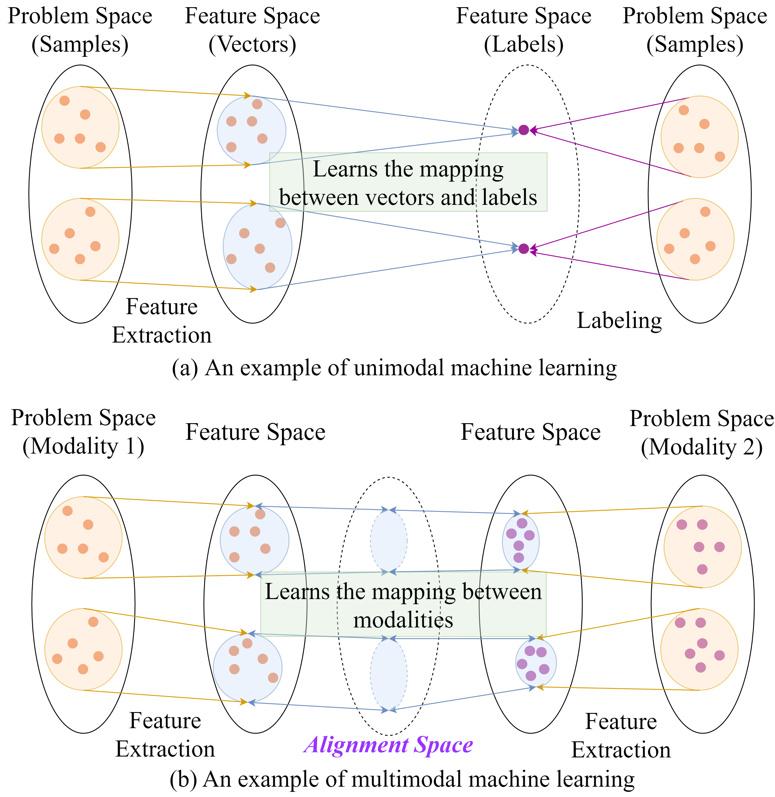
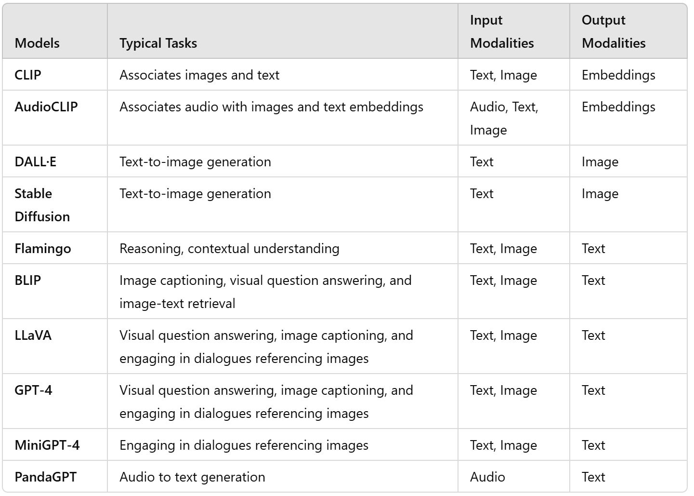
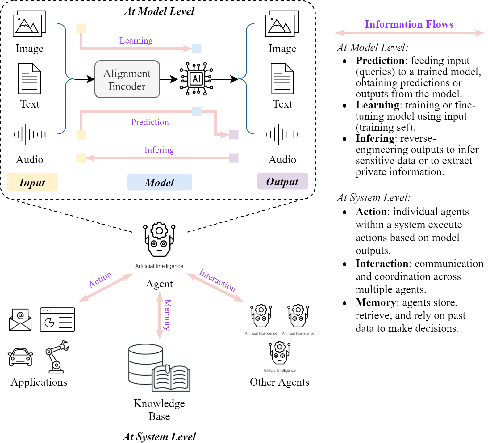
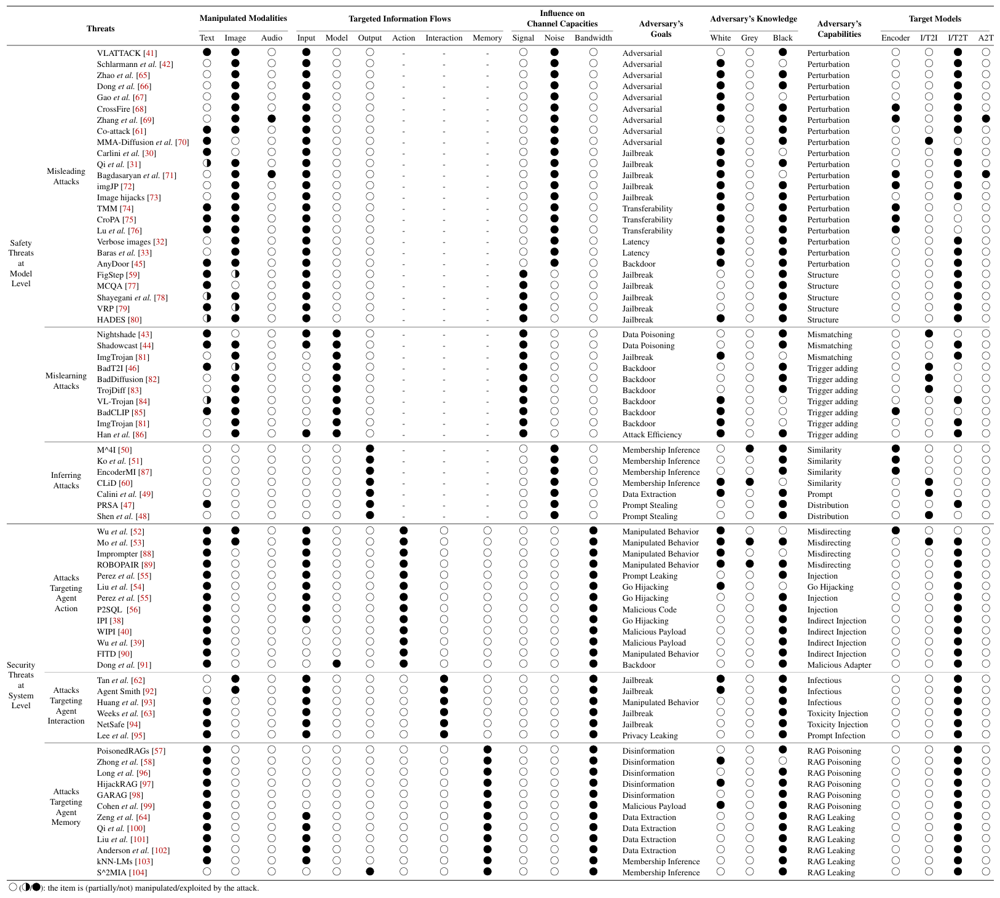

# SoK: Unifying Cybersecurity and Cybersafety of Multimodal Foundation Models with an Information Theory Approach
Multimodal foundation models (MFMs) combine diverse data modalities, driving advancements in AI across various applications but introducing unique safety and security challenges. This study unifies cybersafety and cybersecurity in MFMs, identifying key threats through a taxonomy grounded in information theory. By analyzing threats via channel capacity, signal, noise, and bandwidth, we offer a novel framework to integrate model safety and system security. Our analysis highlights gaps in existing defenses, such as insufficient protection for cross-modality alignment and a lack of systematic defense strategies. This work provides actionable insights to enhance the robustness and reliability of MFMs.

  
   
  <em>An overview of our SoK on unifying cybersecurity and cybersafety of multimodal foundation models.</em>

## Multimodal Foundation Models
In unimodal learning, the model maps input features to output labels within a discrete feature space, focusing on patterns within one data type. It extracts features, converts them into vectors, and then learns the mapping between vectors and labels.

In contrast, multimodal learning involves mapping continuous feature spaces across different modalities, which can be understood as extending the discrete output space of unimodal learning into a continuous space. Instead of directly mapping the spaces, multimodal models create unified representations in an alignment space, linking feature spaces from different data types. 

  
   
  <em>An illustration of single- and multimodal learning.</em>

  
   
  <em>Examples of multimodal large models.</em>

## Unifying Security and Safety in MFMs

A machine learning model can be viewed as a channel for information transmission, where information flows from input samples through the model and ultimately to the outputs, further propagating to other components within a system.

Building on this perspective, information theory provides a robust framework for analyzing the transmission, processing, and fusion of information in multimodal models. 

Specifically, we adapt the Shannon–Hartley theorem, which quantifies the maximum rate at which information can be transmitted over a communication channel (e.g., the model) subject to noise (e.g., threats), for analyzing multimodal safety and security.

  

where:
- \(C\): Channel capacity -> represents the model's ability to effectively learn from and predict based on multimodal inputs, which is essential for assessing how well the model transmits meaningful information.
- \(S\): Signal power -> refers to the meaningful information that can be extracted from various modalities, such as textual features from documents, visual features from images, or auditory features from sound clips.
- \(N\): Noise power -> refers to any irrelevant or disruptive information that can distort the intended signal, which can stem from sources such as data collection errors, sensor inaccuracies, or deliberate perturbations injected into different modalities.
- \(B\): Bandwidth -> refers to the capacity for transmitting effective information between agents or system components, determining how information can be exchanged, which directly impacts the performance and responsiveness of each agent within the system. 

## Information Flows

At the model level, the information flows include prediction, learning, and inferring.
- **Prediction information flow** involves feeding multimodal inputs into a trained model, to generate predictions or outputs, where the inputs are digitized and encoded into latent space representations However, adversarial attacks can introduce malicious inputs that deceive the model, leading to incorrect or biased results.
- **Learning information flow** refers to the process of training or fine-tuning a multimodal model using input from a training dataset. An attacker may inject incorrect or malicious samples into the training dataset, causing the model to mislearn and resulting in incorrect predictions or behavior.
- **Inferring information flow** refers to the path of information in certain attacks where attackers can reverse-engineer model outputs to infer sensitive data or use malicious queries to extract confidential information.

From the system perspective, the information flows between various components, such as models, databases, and applications.

- **Information flow between agents and applications** refers to how agents within a system carry out actions based on the model’s outputs. Attackers may exploit this flow to misdirect the agent’s actions, causing unintended or harmful behaviors.
- **Information flow between multi-agents** involves the communication and coordination between agents within a system. In multi-agent environments, adversaries can exploit this interaction by injecting false information or instructions that propagate throughout the system, disrupting coordination and enabling harmful behaviors to spread across otherwise secure agents.
- **Information flow between agent and system memory**  refers to how agents store, retrieve, and rely on historical data for decision-making. Attackers may target the integrity of this memory by manipulating stored information or introducing false data.

  
   
  <em>An illustration of information flows in MFM system (represented by arrows).</em>

## Taxonomy

  
   
  <em>Taxonomy of safety and security threats in MFMs.</em>

