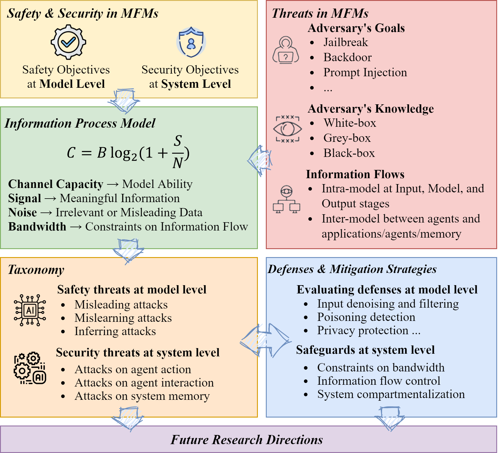
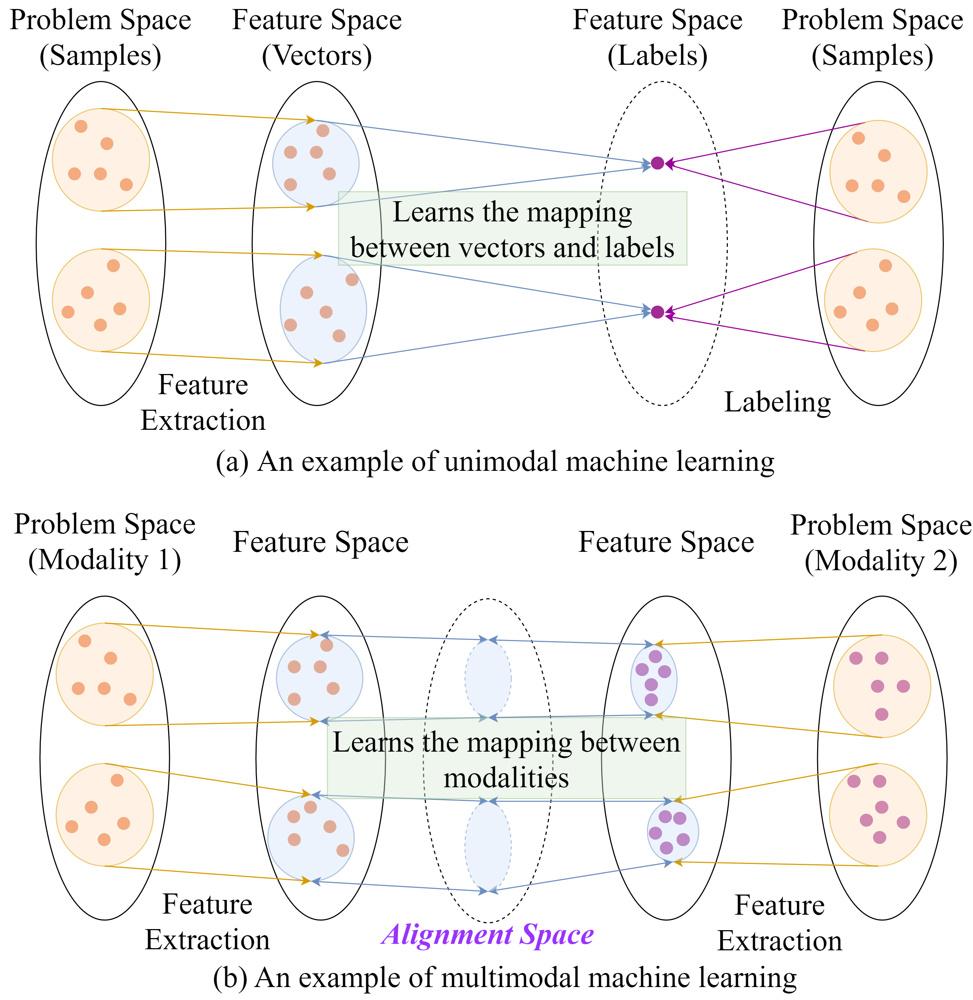

# SoK: Unifying Cybersecurity and Cybersafety of Multimodal Foundation Models with an Information Theory Approach
Multimodal foundation models (MFMs) combine diverse data modalities, driving advancements in AI across various applications but introducing unique safety and security challenges. This study unifies cybersafety and cybersecurity in MFMs, identifying key threats through a taxonomy grounded in information theory. By analyzing threats via channel capacity, signal, noise, and bandwidth, we offer a novel framework to integrate model safety and system security. Our analysis highlights gaps in existing defenses, such as insufficient protection for cross-modality alignment and a lack of systematic defense strategies. This work provides actionable insights to enhance the robustness and reliability of MFMs.

  
   
  <em>An overview of our SoK on unifying cybersecurity and cybersafety of multimodal foundation models.</em>

## Multimodal Foundation Models
In unimodal learning, the model maps input features to output labels within a discrete feature space, focusing on patterns within one data type. It extracts features, converts them into vectors, and then learns the mapping between vectors and labels.

In contrast, multimodal learning involves mapping continuous feature spaces across different modalities, which can be understood as extending the discrete output space of unimodal learning into a continuous space. Instead of directly mapping the spaces, multimodal models create unified representations in an alignment space, linking feature spaces from different data types. 

  
   
  <em>An illustration of single- and multimodal learning.</em>

| **Models**             | **Typical Tasks**                                                                 | **Input Modalities**       | **Output Modalities**  |
|-------------------------|-----------------------------------------------------------------------------------|----------------------------|-------------------------|
| **CLIP**               | Associates images and text                                                        | Text, Image                | Embeddings             |
| **AudioCLIP**          | Associates audio with images and text embeddings                                  | Audio, Text, Image         | Embeddings             |
| **DALL·E**             | Text-to-image generation                                                          | Text                       | Image                  |
| **Stable Diffusion**    | Text-to-image generation                                                          | Text                       | Image                  |
| **Flamingo**           | Reasoning, contextual understanding                                               | Text, Image                | Text                   |
| **BLIP**               | Image captioning, visual question answering, and image-text retrieval             | Text, Image                | Text                   |
| **LLaVA**              | Visual question answering, image captioning, and engaging in dialogues referencing images | Text, Image                | Text                   |
| **GPT-4**              | Visual question answering, image captioning, and engaging in dialogues referencing images | Text, Image                | Text                   |
| **MiniGPT-4**          | Engaging in dialogues referencing images                                          | Text, Image                | Text                   |
| **PandaGPT**           | Audio to text generation                                                          | Audio                      | Text                   |
