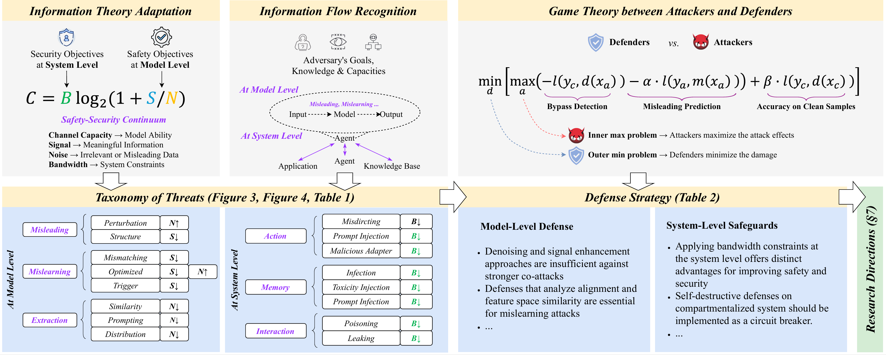
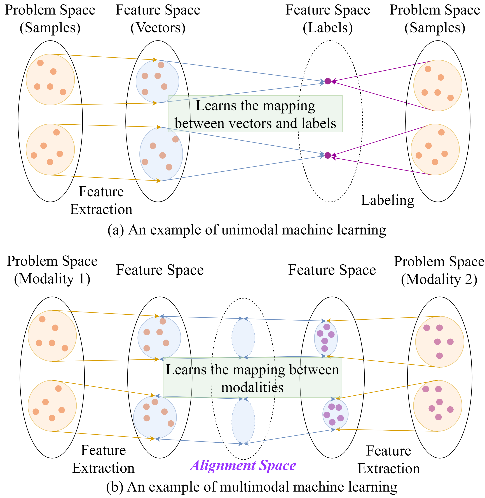
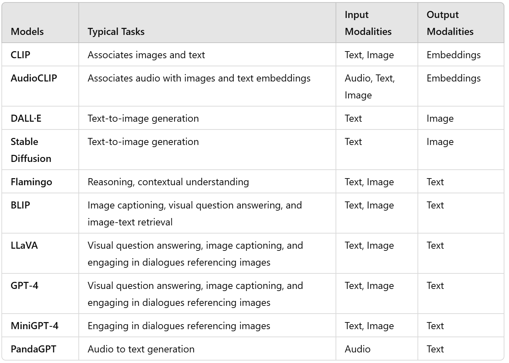
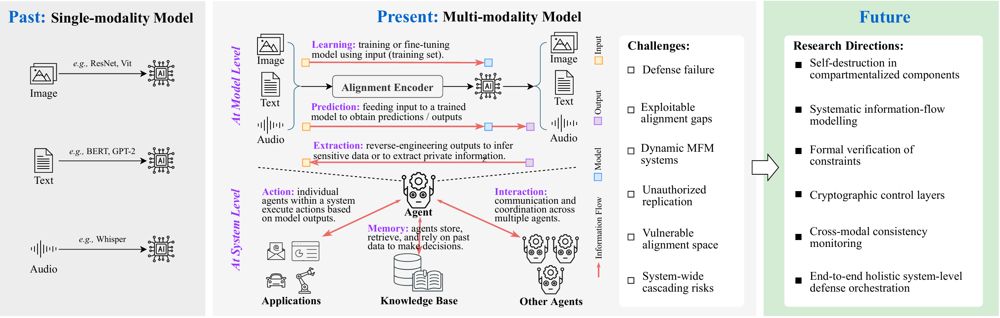
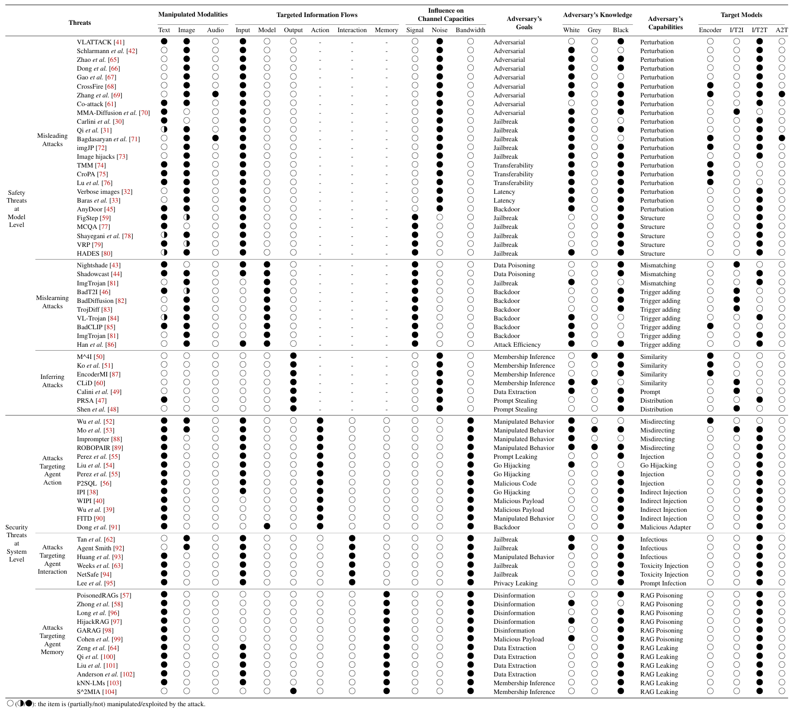

# SoK: The Security-Safety Continuum of Multimodal Foundation Models through Information Flow and Global Game-Theoretic Analysis of Asymmetric Threats
Multimodal foundation models (MFMs) integrate diverse data modalities to support complex and wide-ranging tasks. However, this integration also introduces distinct safety and security challenges. In this paper, we unify the concepts of safety and security in the context of MFMs by identifying critical threats that arise from both model behavior and system-level interactions. We propose a taxonomy grounded in information theory, evaluating risks through the concepts of channel capacity, signal, noise, and bandwidth. This perspective provides a principled way to analyze how information flows through MFMs and how vulnerabilities can emerge across modalities. Building on this foundation, we introduce a deterministic minimax formulation to analyze defense mechanisms and to study a structural asymmetry of defense in multimodal systems. Our analysis indicates that model-centric defenses, which primarily operate by suppressing noise or enhancing signal, tend to exhibit diminishing effectiveness against increasingly adaptive attacks. In contrast, system-level safeguards that constrain authorized information flow and agent behavior impose stronger limits on adversarial impact by reducing effective bandwidth. To operationalize this insight, our framework maps attacks and defenses onto information-theoretic axes, effectively organizing and reducing the defense search space. Using a proposed Defense Coverage Index (DCI) to evaluate 15 representative defenses, we observe that system-level bandwidth constraints provide stronger and more consistent protection across attack classes than brittle model-level mechanisms. Finally, we formalize an MFM ``self-destruction threshold'' that specifies when termination should be triggered, offering a concrete activation rule for circuit-breaker safeguards in multimodal systems.

  
   
  <em>We propose a framework that unifies safety and security in MFMs, use it to categorize threats at the model and system levels, and analyze defenses as a minimax game between attackers and defenders, revealing critical gaps in current research.</em>

## Multimodal Foundation Models
In unimodal learning, the model maps input features to output labels within a discrete feature space, focusing on patterns within one data type. It extracts features, converts them into vectors, and then learns the mapping between vectors and labels.

In contrast, multimodal learning involves mapping continuous feature spaces across different modalities, which can be understood as extending the discrete output space of unimodal learning into a continuous space. Instead of directly mapping the spaces, multimodal models create unified representations in an alignment space, linking feature spaces from different data types. 

  
   
  <em>An illustration of single- and multimodal learning.</em>

  
   
  <em>Examples of multimodal large models.</em>

## Unifying Security and Safety in MFMs

A machine learning model can be viewed as a channel for information transmission, where information flows from input samples through the model and ultimately to the outputs, further propagating to other components within a system.

Building on this perspective, information theory provides a robust framework for analyzing the transmission, processing, and fusion of information in multimodal models. 

Specifically, we adapt the Shannon–Hartley theorem, which quantifies the maximum rate at which information can be transmitted over a communication channel (e.g., the model) subject to noise (e.g., threats), for analyzing multimodal safety and security.

  

where:
- \(C\): Channel capacity -> represents the model's ability to effectively learn from and predict based on multimodal inputs, which is essential for assessing how well the model transmits meaningful information.
- \(S\): Signal power -> refers to the meaningful information that can be extracted from various modalities, such as textual features from documents, visual features from images, or auditory features from sound clips.
- \(N\): Noise power -> refers to any irrelevant or disruptive information that can distort the intended signal, which can stem from sources such as data collection errors, sensor inaccuracies, or deliberate perturbations injected into different modalities.
- \(B\): Bandwidth -> refers to the capacity for transmitting effective information between agents or system components, determining how information can be exchanged, which directly impacts the performance and responsiveness of each agent within the system. 

## Information Flows

At the model level, the information flows include prediction, learning, and inferring.
- **Prediction information flow** involves processing multimodal inputs through the model to produce outputs. Adversaries may introduce malicious inputs to misleading the model, causing inaccurate or biased results.
- **Learning information flow** concerns training or fine-tuning with input data; attackers may poison the training set, causing the model to mislearn and resulting in incorrect predictions or behavior.
- **Reverse extraction information flow** refers to scenarios where adversaries reverse-engineer outputs or use crafted queries to extract private or sensitive information from the model training set.

From the system perspective, the information flows between various components, such as models, databases, and applications.

- **Information flow between agents and applications** governs how agents perform actions based on model outputs. Attackers may exploit this flow to misdirect the agent’s actions, causing unintended or harmful behaviors. 
- **Information flow between multi-agents** involves inter-agent communication and coordination, which can be exploited by adversaries by injecting false information that propagates across the system.
- **Information flow between agent and system memory**  refers to how agents store, retrieve, and rely on historical data for decision-making. Attackers may tamper with memory content to alter agent decision-making over time.
- 

  
   
  <em>An illustration of information flows in MFM system (represented by arrows).</em>

## Taxonomy

  
   
  <em>Taxonomy of safety and security threats in MFMs.</em>

